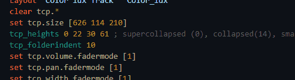
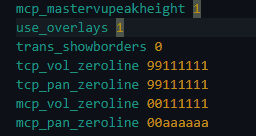
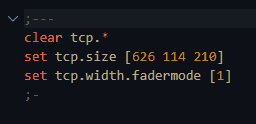
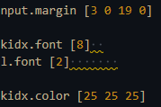

Provides full feature support for WALTER language.

# Attention
- **This extension is in early development. Many features are not ready yet, and some bugs are to be expected. Moreover, it deliberately introduces a few restrictions on possible language constructs to make WALTER more consistent and less error-prone, so you may see a number of diagnostic messages (i.e., errors) in your code, even if it is fully functional. All of this is explained further in this document.**

# Supported features

### Lexical syntax highlighting
- 

### Syntax Validation
- 
- See limitations below.

### Comment toggling
- 
- Press `Ctrl + /` to toggle comment for current line or selection.

### Custom folding regions
- 
- Use `;---` and `;-` to mark the start and the end of a custom folding region, respectively.

### Code linting
Code linting is the automated process of analyzing source code to find formatting errors, stylistic inconsistencies, and potential bugs. Right now only one linting rule is available:
- `walter.linter.noTrailingSpaces` (enabled by default):
  - 
  - Disallows any whitespace characters (spaces or tabs) at the end of a line.

### Other
- Bracket/quote autoclosing.

# Planned features
- Actions:
  - Expand/collapse - automatically breaks a long `set` statement down into a nicely formatted hierarchy of separate expressions, and collapses it back.
- Jump to definition (for user variables and macros).
- Find all references to an identifier.
- Semantic folding (for `macro`s, `layout`s, and long statements).
- Semantic syntax highlighting (for `macro` parameters, identifiers, and user variables).
- Auto-indentation.
- Hover information:
  - Documentation for commands and built-in scalar values.
  - Human-readable diagnostic messages.
  - User documentation comments (JSDoc style or similar).
  - Mappings between attributes and filenames.
- Auto-completion / IntelliSense:
  - Built-in entities (e.g., `tcp.size`, `trans_flags`).
  - Built-in commands (e.g., `define_parameter`).
  - User-defined variables.
- Semantic error checking:
  - Unknown identifier (neither built-in nor user-defined).
  - Unclosed `macro`/`layout` statement.
- Refactoring:
  - Renaming user variables and macros across the document.
- Auto-formatting:
  - Indentation for `layout`s and `macro`s.
  - Removal of trailing whitespace.
- Linting:
  - `noDeadCode` - unused variables and macros, dead branches.
  - `noMixedWhitespace` - mixing tabs and spaces for indentation or in comments.
  - `noMixedQuotes` - using different quote marks across the document.
  - `noConsecutiveBlankLines` - prevents long gaps in code.
  - `consistentIdentifierCase` - enforce `camelCase` or `snake_case`.
  - `noOptionalOperands` - ok: `set trans.play 2>1 5 trans.play` or `set trans.play 2>1 5 .`; not ok: `set trans.play 2>1 5`.
  - `noLayoutVariableLookalikes` - e.g., `tcp.label.myVar`.

# Known issues and limitations
- **Only common characters are allowed in identifier names:**
  - WALTER allows variables to be given almost any name, no matter how unusual – for example, `...`, `-4.0`, `,`, or `"my           var"`. However, to improve code readability and prevent potential errors, the set of allowed characters is restricted to commonly accepted programming conventions: **the first character must be a letter or underscore, and subsequent characters may be letters, digits, underscores, or dots**.
  - The `#` character is temporarily permitted in identifiers (see the next item).
  - Here are a few more examples that illustrate why this restriction exists:
    - The string `10.0a` is interpreted by WALTER as an identifier, not as a misspelled number.
    - Unary minus is not supported for identifiers: writing `-myVar` does not negate the variable - WALTER treats it as an identifier whose name starts with a hyphen.
- **Macros (`macro ... endmacro`) are not fully supported yet:**
  - Implementing full macro support will take some time. If the highlighting of false errors inside macros annoys you, you can disable the parser. To do so, add `"walter.enableParser": false` to your `settings.json`.
  - For now, all `##` are treated as ordinary identifier characters.
- **Using the `def` command is prohibited**, as it introduces ambiguity when reading source code.
- **All places where strings are semantically expected accept only strings. Likewise, all places where identifiers are semantically expected accept only identifiers:**
  - Use `layout "Black" "folder-name"` instead of `layout "Black" folder-name`.
  - Use `set my_var 1` instead of `set "my var" 1`.

# Release Notes
