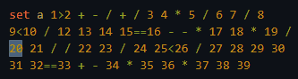

Provides full feature support for the WALTER language.

> **This extension is in early development. Many features are not ready yet, and some bugs are to be expected. Moreover, it deliberately introduces a few restrictions on certain language constructs to make WALTER more consistent and less error-prone, so you may see a number of diagnostic messages (i.e., errors) in your code, even if it is fully functional. All of this is explained further in this document.**

# Supported features

### Syntax Validation

### Hover tooltips

- Hover over any keyword to see its documentation.

### Autocompletion / IntelliSense

- Code completions are suggested as you type.
- You can also open the suggestions menu by pressing `Ctrl + Spacebar`.

### Lexical syntax highlighting

### Expanding and shrinking the selection

- Press `Alt + Shift + Right` or `Alt + Shift + Left` to expand or shrink the selection, respectively.
- This can help you determine the exact boundaries of expressions.

### Comment toggling

- Press `Ctrl + /` to toggle comments for the current line or selection.

### Custom folding regions

- Use `;---` and `;-` to mark the start and end of a custom folding region, respectively.

### Linter
Code linting is the automated process of analyzing source code to find formatting errors, stylistic inconsistencies, and potential bugs.

You can disable any linting rule by adding `"walter.linter.<ruleName>": false,` to your `settings.json` file.
- `noTrailingSpaces` - disallows whitespace characters (spaces or tabs) at the end of a line.
- `noDefCommands` - disallows the use of the `def` command, as it introduces ambiguity when reading source code.
- `noDashesInIdentifiers` - prevents common errors where dashes are mistaken for subtraction, such as `set a -b`.
- `noSingleEquals` - enforces using `==` instead of `=` for equality checks to maintain code consistency.

### Other
- Bracket/quote autoclosing.
- Syntax highlighting in Markdown fenced code blocks.

# Planned features
- Actions:
  - Expand/collapse - automatically breaks a long `set` statements down into a nicely formatted hierarchy of separate expressions, and collapses it back.
- Jump to definition (for user variables and macros).
- Find all references to an identifier.
- Semantic folding (for `macro`, `layout`, and long statements).
- Semantic syntax highlighting (for `macro` parameters and user variables).
- Hover tooltips:
  - Human-readable diagnostic messages.
  - User documentation comments (JSDoc style or similar).
- Semantic error checking:
  - Unknown identifiers.
  - Unclosed `macro`/`layout` statements.
- Refactoring:
  - Rename user variables and macros across the document.
- Auto-formatting:
  - Indentation for `layout` and `macro` blocks.
  - Removal trailing whitespace.
- Color picker for AABBGGRR values.
- Linting:
  - `noDeadCode` - unused variables and macros, and dead branches.
  - `noMixedWhitespace` - mixing tabs and spaces in indentation or comments.
  - `noMixedQuotes` - using different types of quotation marks across the document.
  - `noConsecutiveBlankLines` - prevents excessive consecutive blank lines.
  - `consistentIdentifierCase` - enforces `camelCase` or `snake_case` for user identifiers.
  - `noLayoutElementLookalikes` - e.g., `tcp.label.myVar`.

# Known issues and limitations
- **Only a restricted set of characters is allowed in identifier names:**
  - WALTER allows variables to have almost any name, no matter how unusual - for example, `...`, `-4.0`, `,`, or `"my           var"`. However, to improve code readability and prevent potential errors, only characters commonly used in programming languages are allowed: **the first character must be a letter or underscore, and subsequent characters may be letters, digits, underscores, or dots**.
  - The `#` character is temporarily permitted in identifiers (see the next section).
- **Macros (`macro ... endmacro`) are not supported yet:**
  - Implementing full macro support will take some time. If the highlighting of false errors inside macros is distracting, you can disable the parser. To do so, add `"walter.enableParser": false` to your `settings.json`.
  - For now, all `##` are treated as ordinary identifier characters.
- **All places where strings are semantically expected accept only strings. Likewise, all places where identifiers are semantically expected accept only identifiers:**
  - Use `layout "Black" "folder-name"` instead of `layout "Black" folder-name`.
  - Use `set my_var 1` instead of `set "my var" 1`.
